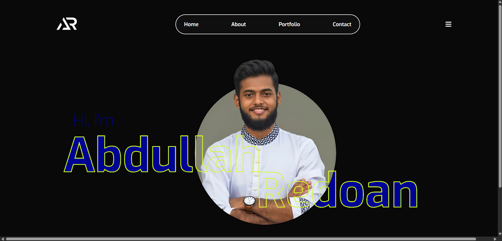

# 🚀 Portfolio

> ⚠️ **Disclaimer:** This project was created **for practice and learning purposes only**. It is a frontend mockup designed to practice HTML5 and CSS3 fundamentals.

---

## 📸 Demo / Preview



---

## 🌐 Live Links

* 📁 **GitHub Repository:** [AbdullahRedoan/DevConf2026]([https://github.com/AbdullahRedoan/portfolio-1/tree/main](https://github.com/AbdullahRedoan/Portfolio-1))

---

## 🛠️ Tech Stack

* **HTML5** – Semantic markup and content structure
* **CSS3** – Custom layout, flexbox/grid, and media queries

---

## ✨ Key Features

* ⚡ **Zero-Framework Build:** Created entirely with vanilla HTML and CSS for lightweight rendering.

---

## 📦 Dependencies

No third-party packages, external libraries, or build tool dependencies (`npm`/`yarn`) are required.

---

## 💻 How to Run Locally

Follow these steps to run the repository on your local setup:

1. **Clone the repository:**
   ```bash

git clone [https://github.com/AbdullahRedoan/Portfolio-1.git](https://github.com/AbdullahRedoan/Portfolio-1.git)
   2. **Enter the project folder:**
   ```bash
   cd portfolio-1
   
3. **Open the application:**
Double-click the index.html file to launch it in any web browser, or serve it using the Live Server extension in VS Code.
